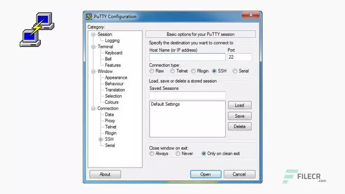
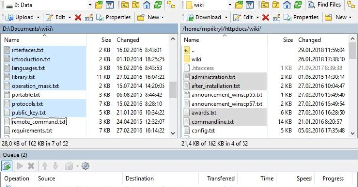

# A workflow for HPC crop simulations (STIC, DSSAT, CELSIUS) using Datamill databasis

Imperial College provides research computing resources for all College researchers, with the standard service for these being free at the point of use.
You must be registered in order to access the HPC service. The steps for registration are described [here](https://www.imperial.ac.uk/admin-services/ict/self-service/research-support/rcs/get-access/) 

## 1 - Prerequists for Windows OS users to connect to the HPC

For Windows users, the interactions with the Imperial College Computing platform can be made with :
-  _Putty_ software (https://www.chiark.greenend.org.uk/~sgtatham/putty/latest.html) to connect to the computing platform
-  _Winscp_ software (https://winscp.net/eng/download.php) to perform the files transfer to the computing platform

These softwares must be installed on the local computer.

A VPN must also be set up to secure the connection : https://www.imperial.ac.uk/admin-services/ict/self-service/connect-communicate/remote-access/virtual-private-network-vpn/  


### Connection to the computing platform

 

 Once Putty software is installed, in the frame 'Host Name (or IP adress)', the domain adress and username must be indicated :

 `user@login.hpc.ic.ac.uk` (replace 'user' by your username), and the connection type must be set on `SSH`. Then click on `Òpen`and type your password.

A terminal appears when the connection is realized. Please note that no graphic interface is provided so the Linux command lines are used.  


### Transfer of files to and from the computing platform

 

Once Winscp software is installed, open it and in the frame `Host name`, type the domain adress `login.hpc.ic.ac.uk`, and the password and username in the appropriate frames. In file protocol, choose 'scp', then click on 'Login' and a double window appears with on the right the file system of the remote computing platform, and on the left, the local file system :


 

In each of the windows, choose the appropriate directories and to transfer a file from a machine to the other, you have to select and drag the file(s).

## 2 - File system

The example directory is located on Imperial college cluster at the adress /rds/general/project/arise/live/CropModellingArise.  

The required subdirectories to launch execution are :
  
`/data` includes input data of DEM, land, grid, soil ans Stics files such as ficplt1.txt   
`/db` includes the MasterInput.db databases with ModelsDictonaryArise.db and the Celsius databasis CelsiusV3nov17_dataArise.db  
`/scripts` list of the scripts called by the main script `main.sh`

On Imperial College, the PBS job scheduler is used, so a launching script `datamill.pbs` must be provided with the container file `datamill.sif` (these files must be located near to the subdirectories data, db, scripts).


## 3 - Launching the workflow on a HPC computer

### Principle 

The launch of the workflow on further nodes is performed with the PBS script `datamill.pbs` which uses a Singularity container `datamill.sif`.

The PBS `datamill.pbs` file is the following :

```
#!/bin/bash
  
#PBS -J 0-49:1
#PBS -S /bin/bash
#PBS -lselect=1:ncpus=48:mem=64gb
#PBS -lwalltime=20:00:00
#PBS -N DATAMILL
#PBS -V

cd $PBS_O_WORKDIR

date

singularity exec --no-home -B $RDS/projects/arise/live/CropModellingArise:/work -B $RDS/projects/arise/live/CropModellingTmp:$TMPDIR datamill.sif /work/scripts/main.sh

date
```

The first lines starting by `#PBS` allow to set up the number of nodes, the number of CPUs per node, the maximum time for the jobs and the job name.
Then for each job, it triggers a running container `datamill.sif` in the host directory  `$RDS/projects/arise/live/CropModellingArise` with an local directory name `work` (the directory name in the image). The directory `$RDS/projects/arise/live/CropModellingTmp` is a temporary directory used by Singularity.
The container `datamill.sif` calls the main script `main.sh`, triggering the steps of the workflow. 

This `main.sh` script triggers the following actions, whose lines can be activated or commented (for example an inactivation can be necessary when the weather data are already loaded because this step is time consuming). All the scripts called in  `main.sh` are located in the subdirectory `scripts`.

Here, we described the main instructions in `main.sh` script that will be managed to address the model simulations.

**3.1. Create subdirectories 'EXPS' and copy of MasterInput, this step must lead to 50 directories 'EXPS' :**

```
python3 ${DATAMILL_WORK}/scripts/workflow/init_dirs.py --index $i;
  wait
```

**3.2. Load Soil data in MasterInput database :**

```  
  python3 ${DATAMILL_WORK}/scripts/netcdf/soil_to_db.py --index $i;
  wait 
```

**3.3. Load climate data  in MasterInput - Higly time consuming, activate when necessary :**

```
python3 ${DATAMILL_WORK}/scripts/netcdf/meteo_to_db.py --index $i;
wait
```

**3.4. Load DEM data in MasterInput :**

```
  python3 ${DATAMILL_WORK}/scripts/netcdf/dem_to_db.py --index $i;
  wait
```

**3.5. Create simunitlist with global parameters of the simulation : soil, dates, ITK (ex: fert0, fert160...) :**
```
  python3 ${DATAMILL_WORK}/scripts/workflow/init_simunitlist.py --index $i;
  wait
```

**3.6. Run Celsius Model :**

```
  /work/scripts/workflow/celsius.sh
  wait

```

 **3.7. Run Stics model :**

```
  /work/scripts/workflow/stics.sh
  wait

```

 **3.8. Run Dssat model :**

 ```
  /work/scripts/workflow/dssat.sh
  wait

```


### Process to launch the workflow taking into account the limited allocated resources to ARISE

  **Create your own repository based on the the `CropModellingArise repository`**

  **Change in the `datamill.pbs` and `merge.pbs` files the name of the work repository: Replace CropModellingArise by the name of your repository**

Due to a limited available resource in terms of number of files or disk space allocated to ARISE, and the high number of files generated by STICS and DSSAT simulations, it is not possible to launch the execution for the three models on all the USM at once. For that, first, we decide to run STICS and Celsius for each management practice, and second, to run DSSAT for each management practice. It requires commenting some parts of the main.sh script and also to change the type of the management practice in the `scripts/workflow/init_simunitlist.py` script.

```
  sql_as_string = """INSERT INTO SimUnitList ( idOption, idPoint, idMangt, IdSoil, StartYear, StartDay,     EndYear, EndDay, idIni, idsim )
                    SELECT DISTINCT SimulationOptions.IdOptions, Coordinate_years.idPoint, CropManagement.idMangt, Soil.IdSoil, Coordinate_years.Year as StartYear, 100 AS StartDay, Coordinate_years.Year as EndYeary,360 as EndDay, 1 as IdIni, Coordinate_years.idpoint || '_' || Coordinate_years.year || '_' || CropManagement.idMangt || '_' || SimulationOptions.IdOptions AS ids
                    FROM CropManagement, SimulationOptions, Soil INNER JOIN (Coordinate_years INNER JOIN RAClimateD ON Coordinate_years.idPoint = RAClimateD.idPoint) ON Soil.IdSoil = RAClimateD.idPoint
                    where CropManagement.idMangt='Fert0' ORDER BY  Coordinate_years.idPoint, CropManagement.idMangt, Soil.IdSoil, Coordinate_years.year, SimulationOptions.IdOptions;"""

```

The job `datamill.pbs` can be launched to trigger the workflow with the command : 

```
qsub datamill.pbs
```

  **To launch the job to Run STICS and CELSIUS model :**

  - In `main.sh`, comment `section 3.8` 
  - Launch the job with the type of the management practices (ex: `Fert0`, `Fert80`, `Fert160`) in the   init_simunitlist.py script
  - After the first launch (ex: with `Fert0`), you can comment section 3.1, 3.2, 3.3 and 3.4 to launch with the other type of management practices

  **To launch the job to run DSSAT model:**

  - In `main.sh`, comment `section 3.6` and `section 3.7` 
  - Launch the job with the type of the management practices (ex: `Fert0`, `Fert80`, `Fert160`) in the /init_simunitlist.py script
  - After the first launch (ex: with `Fert0`), you can comment section 3.1, 3.2, 3.3 and 3.4 to launch with the other type of management practices


The launch of the script inserts the requested jobs in a queue while waiting for the availability of the computing ressources. With that experiment, a set of 50 nodes with 48 CPUs on each nodes is then requested. 

The state of the job can be checked with the command 

```
qstat -u $user
```
 Which returns :

```
 pbs: 
                                                            Req'd  Req'd   Elap
Job ID          Username Queue    Jobname    SessID NDS TSK Memory Time  S Time
--------------- -------- -------- ---------- ------ --- --- ------ ----- - -----
5303692[].pbs   mginer   v1_singl DATAMILL      --    1  48   64gb 20:00 Q   --  `

```

In this table :
- `Job ID` is the ID of the job,
- `username` is the name of the account from where the job has been launched
- `Queue` is the name of the queue where the user is allowed to reserv nodes
- `NDS`: number of nodes requested
- `TSK`: number of CPUs (tasks) requested per node
- `Reqd Memory`: maximum amount of memory requested for these jobs- 
- `Reqd Time`: time limit after wich the simulation is 
-  `S` : status of the job : (B) run for array jobs, (Q) in queue, etc ...
-  `Elap time`: elapsed time since the beginning of the simulation 

The simulation is running when the status is set on (B).

While the simulation is running, a set of files `DATAMILL.o*.*` are created with the output of each job (allowing to verify the step performed by the main.sh script), and a set of file `DATAMILL.e*.*` are created to display the errors during the workflow.

To kill a job, pick its ID with the `qstat -u $USER` command line, and type (ID of job is 5303692[].pbs in this example):

```
qdel 5303692[].pbs
```

  **After each execution, remove all `DATAMILL.o*.*` and `DATAMILL.e*.*`files** generated in the working repository

  **Launch merge.pbs job**
  
  After launching the job for all models and management practices, it requires to launch `merged.pbs` that allows to merge all the results from each model with different simulation options and management practices.
  The combined results are saved in `outputs` folder.


